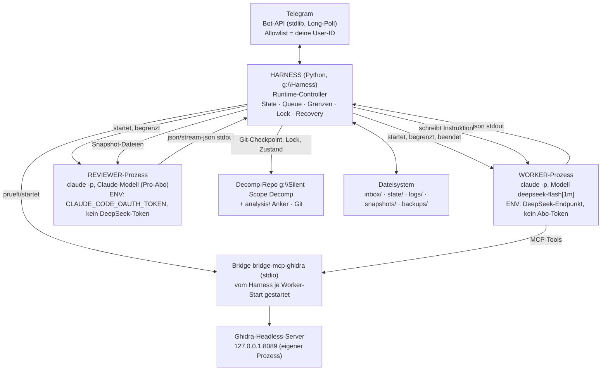
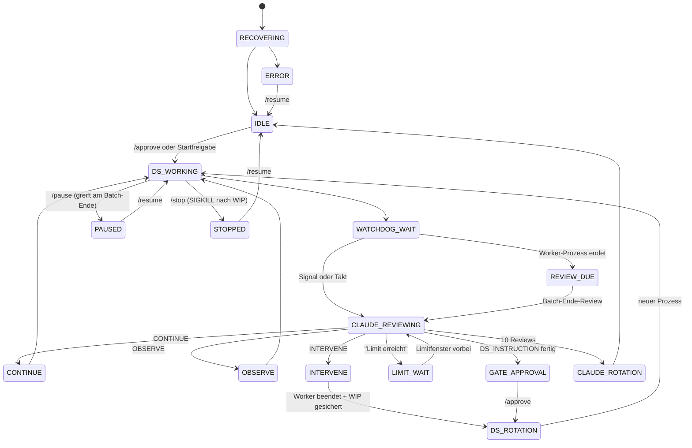
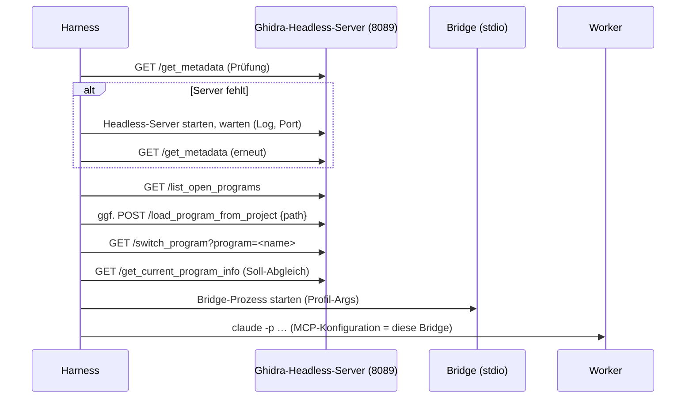

# Stufe 2 — Architekturplan: autonomes Worker/Reviewer/Telegram-Harness

**Projekt:** Silent Scope Decomp (Konami Silent Scope 1 / Hornet / Voodoo 1) — Harness
**Datum:** 2026-09-25 · **Arbeitslauf:** Copilot Chat, Modell `deepseek/deepseek-flash` (DeepSeek V4.1 Flash, BYOK)
**Grundlage:** Auftrag „Planung eines autonomen DeepSeek/Claude/Telegram-Harness", Abschnitte 1–23 (Originaltext, s. Vorab-Prüfung) → **Stufe 2** (Architektur, Abschnitte B–P) + **Q** (Werkzeugprofile/Programmfeld) + **R** (offene Entscheidungen)
**Vorgänger:** `g:\Harness\docs\stage1-inventory.md` (Abschnitt **A** ist dort erledigt und wird hier nur referenziert)
**Reichweite:** Nur Planung. Es wurde **nichts installiert, nichts getestet, kein Worker/Ghidra-Werkzeug aufgerufen, kein Programm in Ghidra gewechselt**. Neu angelegt wurde ausschließlich diese Datei.

---

## 0. VORAB-PRÜFUNG (Auftragsklausel)

**Ergebnis: kein STOPP — der Originaltext liegt vollständig und wörtlich vor.**

| Frage | Befund |
|---|---|
| Liegt die ursprüngliche Aufgabenstellung (Abschnitte 1–22, insbesondere 20 A–P) vor? | **Ja, wörtlich.** Sie ist als Chat-Paste im Sitzungskontext erhalten (`vscode-chat-response-resource:/assoc/chat-paste-e1373c89-…/Pasted text #1`, Abschnitte **1–23** inkl. `20 A. … P.`, gelesen am 2026-09-25) [beobachtet: Paste-Ressource, Zeilen 1–60 / 61–560 / 561–1100] |
| Ist zusätzlich Abschnitt 23 („Ergänzende Vorgaben, haben Vorrang") vorhanden? | Ja — Stufenregel, Entscheidungsvorlage (a)/(b)/(c), Claude-Code-Vorwissen, sechs Zusatzpunkte für Stufe 2 [beobachtet: ebd.] |
| Ist der Katalog durch E1–E10 überholt? | Nur in den **Entscheidungen**; der **Anforderungskatalog** bleibt gültig. Abgleich in **Anhang 1** (Erfüllungsmatrix) |
| Nicht mehr rekonstruierbar | Nichts. Die Rohform der Paste selbst ist nicht im Repo gesichert — sie ist nur Sitzungskontext [Vorschlag: nach `docs/` spiegeln, s. R17] |

**Gelesene Grundlagen (nur lesen):** `docs/stage1-inventory.md`; `sandbox/results-bprime.md`, `results-bprime-2.md`, `results-probe.md`, `ghidra-tools.md`; `Silent Scope Decomp\AGENTS.md`, `analysis\r1b-workstream.md` (Kopfblock), `analysis\ghidra-mcp-notes.md` (§„Mehrprogramm-Betrieb im Headless-Server", §„Programmwechsel headless", §„Verbindungsarchitektur", §„Headless-Server"). Offizielle Doku zusätzlich für §K/§M/R: Claude-Code-CLI-Referenz und Umgebungsvariablen-Referenz (`code.claude.com/docs/en/cli-reference`, `…/env-vars`, gelesen 2026-09-25).

## 0.1 Kennzeichnung (wie Stufe 1)

| Marker | Bedeutung |
|---|---|
| `[beobachtet: <Pfad/Befehl>]` | in dieser Sitzung selbst gelesen bzw. gemessen |
| `[gemessen: <Datei>]` | Zahl stammt aus einem dokumentierten Lauf in `sandbox/` |
| `[offiziell: <URL>]` | offizielle Dokumentation |
| `[Entscheidung E…]` | vom Nutzer festgelegt, wird nicht neu diskutiert |
| `[Vorschlag]` | Entwurf des Planers, zur Freigabe |
| `[nicht geprüft]` | offen — gehört in die Testliste (R/P) |

Es wird bewusst **kein** „CONFIRMED" für plausibel klingende Aussagen vergeben.

---

## B. Empfohlene Architektur

### B1 Komponenten (aus E1/E2/E9 abgeleitet)



**Rollen (unverändert aus dem Original-Abschnitt 2, präzisiert):**

| Komponente | Rolle | Darf **nicht** |
|---|---|---|
| **Worker** (Claude Code + DeepSeek-Endpunkt) | eigentliche RE-Arbeit: lesen, dekompilieren, Portcode ändern, bauen, testen, `analysis/` pflegen, committen | Reviewer spielen · Werkzeugprofil selbst erweitern · Programm in Ghidra wechseln |
| **Reviewer** (Claude Code + Pro-Abo) | Stand bewerten, Fehlentwicklungen erkennen, nächste Instruktion + Telegram-Zusammenfassung erzeugen | Dateien schreiben · Batches ausführen · Worker-Prozesse steuern |
| **Harness** | Runtime-Controller: starten, begrenzen, messen, Queue, State, Lock, Recovery, Telegram | semantische RE-Entscheidungen treffen (Original §„Lokales Harness") |
| **Telegram** | Bedien-/Monitoring-Oberfläche | Arbeit unterbrechen (Nachrichten sind Queue-Dateien, E9) |
| **Ghidra/Bridge** | Analyse-Backend, ein gemeinsamer Server | — |

### B2 Prozess-Lebensdauern (Grundlage für 24/7)

| Prozess | Lebensdauer | Beleg |
|---|---|---|
| Ghidra-Headless-Server (java, Port 8089) | **dauerhaft**, überlebt VS Code; startet der Harness bei Bedarf selbst | `[beobachtet: stage1-inventory.md §M2, Logs]` |
| Bridge `bridge-mcp-ghidra` (stdio) | **je Worker-Prozess** neu, vom Harness direkt gestartet (nicht über den Wrapper) | `[Entscheidung E7]` |
| Worker/Reviewer (`claude -p`) | **ein Prozess = ein Batch** = ein neuer Chat | `[Entscheidung E1]` |
| Harness | dauerhaft (Task-/Dienststart), Zustand persistent | `[Entscheidung E9/E10]` |

**Zentrale Abweichung von heute:** Der Harness startet die Bridge **direkt** (`tools\bridge-venv\Scripts\bridge-mcp-ghidra.exe …`) statt über `scripts\start-mcp-bridge.ps1` `[Entscheidung E7]`. Der Wrapper bleibt als manueller Notfallweg und wird **nicht geändert** (er gehört dem Decomp-Repo, das nicht umgebaut wird) `[Entscheidung E10]`. Achtung: der Wrapper startet heute auch den Server und wartet bis 300 s `[beobachtet: stage1-inventory.md §M1]` — diese Aufgabe übernimmt der Harness selbst (§M1). Die Bridge-Auflösung wird aus dem Wrapper übernommen; erste Wahl ist `<ws>\tools\bridge-venv\Scripts\bridge-mcp-ghidra.exe` `[beobachtet: start-mcp-bridge.ps1, Funktion `Resolve-Bridge`].

### B3 Werkzeugtrennung: Built-ins fest, Ghidra-Profil nur für MCP (R7b-Entscheidung)

Der Plan trennt **zwei** Werkzeugklassen, die nichts miteinander zu tun haben:

| Klasse | Wer steuert sie | Wert (fest) |
|---|---|---|
| **Built-in-Werkzeuge** (Datei lesen/schreiben, Suchen, Shell) | **unabhängig vom Ghidra-Profil, immer gleich** | `Read`, `Write`, `Edit`, `Glob`, `Grep`, **`PowerShell`** — ohne sie kann der Worker keinen Port-Batch fahren (Bauen, Harness, Git-Werkzeuge des Projekts) `[Entscheidung R7b]` |
| **MCP-Werkzeuge (Ghidra)** | **Profil** aus `<DS_TOOLS>profile: …</DS_TOOLS>` (E4/Q) | `none` (kein Server) / `ghidra-read` / `ghidra-standard` / `ghidra-full` |

Umsetzung: die Built-ins werden über `--tools` **fixiert** (offiziell belegt: „Restrict which built-in tools Claude can use … A list that omits …") und über `--allowedTools` freigegeben; das Profil steuert ausschließlich `--mcp-config`, `--allowedTools`-MCP-Namen und `--disallowedTools`-MCP-Namen `[offiziell: cli-reference; gemessen: results-probe.md §0/§2.7]`.

**Wichtig:** `--disallowedTools` und `--tools` sind **keine** Rechtevergabe für MCP — `--tools` „doesn't affect MCP tools; to deny those too, use `--disallowedTools "mcp__*"`" `[offiziell: cli-reference]`, deshalb steht die MCP-Sperre immer zusätzlich in `--disallowedTools`.

---

## C. Zustandsmaschine

### C1 Zustände

| Zustand | Bedeutung | Persistiert in |
|---|---|---|
| `IDLE` | kein Batch aktiv, nichts zu tun (wartet auf `/approve`, `/ds`, Zeitplan) | `state/run.json` |
| `GATE_APPROVAL` | Batch-Ende-Review fertig, Harness wartet auf `/approve` (Freigabemodus E10) | `state/run.json` |
| `DS_WORKING` | Worker-Prozess läuft | `state/run.json` + `state/worker.json` |
| `REVIEW_DUE` | Worker beendet, Review noch nicht gestartet | ebd. |
| `CLAUDE_REVIEWING` | Reviewer-Prozess läuft (Batch-Ende **oder** Watchdog) | `state/review.json` |
| `WATCHDOG_WAIT` | Worker läuft, nächster Watchdog-Termin steht (60–90 min oder Signal) | `state/run.json` |
| `CONTINUE` | Reviewer sagt CONTINUE (Watchdog) → zurück nach `DS_WORKING` | `state/reviews.jsonl` |
| `OBSERVE` | Reviewer sagt OBSERVE → Worker läuft weiter, nächster Check früher | ebd. |
| `INTERVENE` | Reviewer sagt INTERVENE → Worker wird beendet, WIP gesichert, neue Instruktion | ebd. |
| `DS_ROTATION` | Übergang: alter Batch zu, neuer Batch auf (immer, E1) | `state/run.json` |
| `CLAUDE_ROTATION` | Reviewer-Session nach ~10 Reviews wechseln (E10) | `state/reviewer_session.json` |
| `PAUSED` | Nutzer hat pausiert; laufender Worker läuft zu Ende, **kein** neuer Start | `state/run.json` |
| `LIMIT_WAIT` | Pro-Abo-Limit des Reviewers erreicht → Warten + Telegram (E2) | `state/review.json` |
| `STOPPED` | Nutzer hat gestoppt; kein automatischer Neustart ohne `/resume` | `state/run.json` |
| `RECOVERING` | Harness startet neu und stellt Zustand aus Dateien wieder her | `state/recovery.json` |
| `ERROR` | harter Fehler (Ghidra weg, Repo divergiert, Budget aufgebraucht) → Telegram, Halt | `state/run.json` |

### C2 Übergänge (wesentliche)



### C3 Regeln, die den Zustandsraum klein halten `[Vorschlag]`

1. **Genau ein Worker-Prozess und höchstens ein Reviewer-Prozess gleichzeitig.** Ein Start zweier Worker wäre ein Fehler → `ERROR`.
2. **`INTERVENE` ist der einzige Weg, einen laufenden Worker hart zu beenden** (E6). `/stop` und `/pause` sind Nutzerwege mit derselben Vorsicht (erst WIP-Sicherung).
3. **Watchdog nur bei Signal oder Takt** (E5): Die mechanische Vorprüfung im Harness (kein Fortschritt, wiederholte identische Aufrufe, Token ohne neue Artefakte) entscheidet, sonst spätestens alle 60–90 min.
4. **Batch-Ende-Review ist der Hauptmechanismus** — der Watchdog ist die Ausnahme (E5; Beleg für „lange autonom": eine Nutzernachricht → **168** Assistentenschritte mit **181** Werkzeugausführungen in einer echten DS-Sitzung `[gemessen: stage1-inventory.md §L2]`).
5. **Programmwechsel ist kein Zustand des Workers, sondern des Harness** (E7, §M2).

---

## D. Dateisystem

### D1 Verzeichnisse (`g:\Harness`, außerhalb des Decomp-Repos — E10)

```text
g:\Harness\
    Harness.code-workspace        (vorhanden; Multi-Root)
    docs\
        stage1-inventory.md       (vorhanden)
        stage2-architecture.md    (diese Datei)
    harness\                      [Vorschlag: neuer Code; NICHT ins Decomp-Repo]
        app\                      Python-Module (Controller, Worker, Reviewer, Telegram, Snapshot, Lock)
        config\                   harness.toml (Pfade, Grenzen, Taktzeiten, Profil->Werkzeugliste)
        profiles\                 ghidra-none.json, ghidra-read.json, … (E4/Q)
    secrets\                      (gitignored, vorhanden)
        deepseek.key              (vorhanden, 35 B)
        claude-oauth.key          [fehlt — Nutzeraktion, R2]
        telegram.json             [fehlt — Nutzeraktion, R1]
    state\
        run.json                  laufender Batch/Zustand (atomar geschrieben)
        worker.json               PID, Startzeit, Session-ID, Zähler
        review.json               Review-Status, Limit-Zustand, letzte Entscheidung
        reviewer_session.json     Session-ID + Review-Zähler (Rotation, E10)
        budget.json               Tageszähler Kosten/Token, Stopp-Schwelle
        git-lock.json             Schreib-Lock (E8)
        recovery.json             letzter bekannter guter Stand
    inbox\
        ds\   claude\   done\     Nachrichten-Queue (§E)
    outbox\
        telegram\                 ausgehende Nachrichten (Retry bei Telegram-Ausfall)
    logs\
        harness-<ts>.log          Harness-Ereignisse (JSON-Zeilen)
        worker-<batch>.stream.jsonl   Rohstrom des Workers (append-only)
        reviewer-<id>.json        Reviewer-Ausgabe
        watchdog-<ts>.json        mechanische Signale
    snapshots\
        <batch>\snapshot.md       kompakter Review-Kontext (§G)
        <batch>\tools.tsv         Werkzeugname + Argumente
        <batch>\reasoning.jsonl   Reasoning NUR als Rohdatei (E5)
    backups\
        ghidra\sscope-uad_<ts>.gar    Projekt-Backup vor schreibenden Batches (E6)
    sessions\
        claude\<session-id>.md    Übergabedatei der Reviewer-Rotation (E10)
    runs\
        b<NNN>\                   je Batch: Auftrag, Instruktion, Ergebnis, Kosten
```

**Regel:** Das Decomp-Repo wird **nicht** umgebaut (E10). Der Harness liest/schreibt dort nur über Git und über die vorhandenen Projektwerkzeuge. Alles Neue liegt unter `g:\Harness\` `[Entscheidung E10]`.

### D2 Atomare Updates

- Zustandsdateien werden **immer** `…tmp` geschrieben, geflusht, dann per `os.replace` ersetzt `[Vorschlag]`.
- Append-only Dateien (`.stream.jsonl`, `logs/*.log`, `reviews.jsonl`) sind **zeilenweise** auswertbar; eine halb geschriebene letzte Zeile wird beim Lesen verworfen (Erkennung: kein gültiges JSON) `[Vorschlag]`.
- `state/run.json` trägt eine **Generation** (`gen`, monoton) und die `batch_id` — damit erkennt der Harness nach einem Absturz, ob er den Zustand noch verwenden darf `[Vorschlag]`.

### D3 Was **nicht** in den Harness gehört

- **Projektwissen** bleibt im Repo (`analysis/`, Ankerdatei `r1b-workstream.md`, `ghidra-mcp-notes.md`, `analysis/_memory/*`) — Originalabschnitt 16 verbietet eine zweite Wahrheit. Der Harness speichert nur **technischen** Zustand `[Entscheidung E10 + Original §16]`.
- Ghidra-Projektdaten (`ghidra\sscope-uad.rep`) sind gitignoriert → eigener Backup-Pfad (§J3).

---

## E. Nachrichten-/Queue-Modell

### E1 Dateiformat (Original §7, unverändert gültig)

`inbox/ds/2026-09-25_153455_<kurzid>.md` — Inhalt mindestens:

```markdown
---
id: 2026-09-25_153455_a41c        # eindeutig, unveraenderlich
ts: 2026-09-25T15:34:55+02:00
target: ds                        # ds | claude
source: telegram
user_id: 123456789
kind: message                     # message | command
---
/ds Prüfe zusätzlich FUN_8005471C.
```

- **Zustellung:** Eine `ds`-Nachricht wird **niemals** in einen laufenden Worker injiziert (Original §7, E9). Sie wird beim **nächsten Batch-Übergang** als Block „NACHRICHTEN AUS DER QUEUE" an die Instruktion angehängt.
- `claude`-Nachrichten gehen als Block in den nächsten Reviewer-Aufruf (Batch-Ende oder Watchdog).
- Nach Zustellung: Datei wird nach `inbox/done/` **verschoben** (idempotent), die `id` wandert in `state/…` „zugestellt" `[Vorschlag]`.

### E2 Nebenläufigkeit, Idempotenz (Original §17)

| Anforderung | Umsetzung |
|---|---|
| Locking bei gleichzeitigem Zugriff | Telegram-Schreiber (Harness) und Worker (kein Direktzugriff) — nur **ein** Schreiber; zusätzlich Datei-Lock über `os.open(..., O_CREAT\|O_EXCL)` für die Anhänge-Phase `[Vorschlag]` |
| Keine doppelte Verarbeitung | `id` + Zustell-Liste in `state/run.json`; Verschieben statt Löschen |
| Eindeutige Message-IDs | Zeitstempel + 4 Hex aus `secrets`-freiem Zufall; Telegram-`update_id` wird zusätzlich gespeichert (Long-Poll-Offset) |
| Idempotente Verarbeitung | Ein zustellbarer Block wird genau einmal in ein `runs/b<NNN>/auftrag.md` geschrieben; Wiederholung erkennt die Datei und überspringt |
| Reihenfolge | Sortierung nach `ts`, dann `id` (lexikografisch) |

### E3 Telegram-Ausfall

Ausgehende Nachrichten landen zuerst in `outbox/telegram/`, ein Wiederholer versendet sie mit Backoff; erst nach Erfolg → `outbox/sent/` `[Vorschlag]`. Damit ist „Telegram-Ausfall" (Original §17) kein Datenverlust, sondern nur ein Verzug.

---

## F. Claude ↔ DS-Protokoll

### F1 Austauschformat (Original §4, von E1/E4/E7 erweitert)

Der Reviewer liefert **immer** markierte Blöcke; alles außerhalb wird nicht interpretiert, aber vollständig archiviert (`logs/reviewer-<id>.json`) `[Original §4: „Die komplette originale Claude-Antwort soll zusätzlich unverändert archiviert werden"]`:

```text
<TELEGRAM_SUMMARY>
… für den Nutzer, menschenlesbar …
</TELEGRAM_SUMMARY>

<DS_TOOLS>
profile: ghidra-read
program: /830d01.27p.main.bin
</DS_TOOLS>

<DS_INSTRUCTION>
… der Batch-Auftrag im gewohnten Aufbau (STAND ÜBERNEHMEN / ARBEITSWEISE / TEIL 1 / TEIL 2 / BATCH-ENDE) …
</DS_INSTRUCTION>
```

**Watchdog-Antwort** (Original §14 + E5):

```text
<DECISION>
CONTINUE | OBSERVE | INTERVENE
</DECISION>

<PROBLEM>
… nur bei OBSERVE/INTERVENE; konkret und mit Datei:Zeile …
</PROBLEM>

<DS_INSTRUCTION>
… nur bei INTERVENE (die neue Instruktion) …
</DS_INSTRUCTION>
```

### F2 Robustheit des Parsers (Original §4 „Parser-Fehler, unvollständige Antworten, Wiederaufnahme")

| Fall | Verhalten `[Vorschlag]` |
|---|---|
| Block fehlt / Tag unvollständig | **kein** automatischer Start. Zustand `GATE_APPROVAL` mit Telegram-Hinweis „Review unvollständig, Rohtext in `<Pfad>`". Nie „raten". |
| Block mehrfach vorhanden | erster Block gewinnt, Mehrfachvorkommen wird gemeldet |
| `DS_TOOLS` fehlt | Profil = Vorgänger-Profil (nur wenn identisches Programm), sonst `LIMIT` → Telegram |
| `decision` unbekannt | wird wie `OBSERVE` behandelt (konservativ) + Telegram |
| Prozess endet ohne `result`-Ereignis | Rohtext archivieren, `LIMIT_WAIT`/`ERROR`, Telegram |
| Reviewer-Session zu groß | Rotation (§H2) oder `--resume` der laufenden Session innerhalb der Grenze |

### F3 Werkzeugmangel-Rückkanal (E4)

Fehlt dem Worker ein Werkzeug, meldet er es am Batch-Ende in einem festen Block:

```text
<TOOL_REQUEST>
mcp__ghidra__decompile_function
</TOOL_REQUEST>
```

Der Harness leitet das an den Reviewer weiter; der Reviewer wählt beim **nächsten** Batch ein größeres Profil (E4). Es gibt **kein** Nachladen zur Laufzeit (die Tool-Liste ist pro Prozessstart fix, §M/N).

---

## G. Snapshot-Mechanik

### G1 Quelle

Der Harness liest **seinen eigenen** Mitschnitt `logs/worker-<batch>.stream.jsonl` (`--output-format stream-json --verbose`) `[Entscheidung E1]`. **Nicht** verwendet werden VS-Code-Transkripte — der (a)-Weg ist nur Rückfall (E1).

### G2 Deduplizierung (Pflicht, gemessen)

Eine API-Antwort erzeugt **mehrere** `assistant`-Ereignisse (je Inhaltsblock: Thinking/Text/Werkzeugaufruf). Ungefiltert summieren sich die Token dadurch ~2,9-fach. Der Harness dedupliziert **nach `message.id`** (Anfrage) bzw. **`tool_use.id`** (Aufruf) `[Entscheidung E1; gemessen: results-probe.md §2.7 — Rohdatei 4,7 MB / 21661 Ereignisse → 38 echte Anfragen, 57 Werkzeugaufrufe]`.

### G3 Inhalt

| Bestandteil | In den Reviewer-Kontext? | Umfang |
|---|---|---|
| Texte des Workers (`content[].type=="text"`) | **ja**, letzte N + alle mit Markern (`<TOOL_REQUEST>`, Zusammenfassung) | Ziel ≤ 6–10 kB |
| Werkzeugname + Argumente (kompakt, tabellarisch) | **ja** (`snapshots/<batch>/tools.tsv`) | je Aufruf 1 Zeile |
| Denk-/Reasoning-Blöcke | **nein** → nur `snapshots/<batch>/reasoning.jsonl` | Rohdatei (E5) |
| Geänderte Dateien, Git-Diff-Stat | **ja** (`git status --porcelain`, `git diff --numstat`) | klein |
| Harness-Kennzahlen | **ja**: Laufzeit, Anfragen, Tool-Calls, Token (Miss/Hit/Ausgabe), Kosten, Grenzen | 5–10 Zeilen |
| `analysis/`-Ankerkopf | **ja**, wörtlich (der Reviewer braucht den Projekt-Anker) | 5 Zeilen |

### G4 Vorlagen

**Batch-Ende-Snapshot** (Vollstand): Ankerkopf · Harness-Kennzahlen · Werkzeugliste (Aggregat) · Antworttexte (vollständig, verdichtet) · Dateiänderungen · offene Marker · Queue-Nachrichten.
**Watchdog-Snapshot** (Zwischenstand): wie oben, aber ohne Antworttexte — nur Kennzahlen, Werkzeugliste **seit letztem Snapshot**, letzte 20 Textzeilen, mechanische Signale.

**Mechanische Signale** (Takt/Wecker, E5) `[Vorschlag]`:

| Signal | Schwellwert |
|---|---|
| kein Fortschritt | seit X min kein neuer Werkzeugaufruf **und** keine Dateiänderung |
| Wiederholung | ≥ 3× identischer Aufruf (Name+Argumente) in Folge |
| Token ohne Artefakt | ≥ N Token Ausgabe ohne neue/veränderte Datei |
| Grenznähe | Laufzeit/Anfragen/Kosten > 80 % des Batch-Limits |
| Dürrephase | nur `Read`/`Grep` auf bereits gelesenen Dateien (≥ 10 in Folge) |

---

## H. Session-Management

### H1 Worker

- **Ein Batch = ein Prozess = ein neuer Chat** `[Entscheidung E1]`. Der „Chat" ist der Prozesslauf; es gibt **kein** Weiterfüttern (Original §5).
- Projektregeln kommen **per `@`-Import über die Junction ohne Leerzeichen** — keine Kopie der `AGENTS.md` `[Entscheidung E1; gemessen: results-bprime-2.md §2, A1b liefert beide Überschriften wortgleich]`.
- Der Harness startet jeden Batch mit `--session-id <neue UUID>` (erzeugt eine frische Sitzung, offiziell belegt) `[offiziell: cli-reference]`.
- **Programm und Profil** werden **vor** dem Start festgelegt und geprüft (§M2/E7).

### H2 Reviewer-Rotation (E10, Original §6)

| Punkt | Regel `[Entscheidung E10]` |
|---|---|
| Auslöser | nach **~10** Reviews (Zähler in `state/reviewer_session.json`) |
| Übergabe | der Reviewer schreibt **selbst** `sessions/claude/<session>.md`: laufender Batch, letzte Entscheidungen, offene Punkte, Wechselgrund |
| Start der neuen Session | Übergabedatei + Projekt-Ankerköpfe (`r1b-workstream.md`-Kopf, `ghidra-mcp-notes.md`-Kopf) |
| Was **nicht** passiert | der alte Verlauf wird nicht mitgeschleppt (genau der Zweck der Rotation) |
| Zusätzliche Persistenz | `state/` (technisch) + `analysis/` (Projektwissen) bleiben die Quellen; der Chat ist nie Wissensspeicher |

### H3 Reviewer-Werkzeuge (E2)

**Vorschlag: nur `Read`, `Grep`, `Glob`** — damit kann der Reviewer Datei:Zeile-Belege des Workers **stichprobenartig prüfen**, ohne ‚arbeiten' zu können: kein `Bash` (keine Befehle), kein `Write`/`Edit` (kein Eingriff), keine MCP-Werkzeuge (kein Ghidra-Zugriff, keine Schreibspur), kein `WebFetch` (kein Zufallsverkehr).

**Abwägung gegen das Pro-Kontingent** `[Vorschlag]`:

| Werkzeug | Nutzen | Kontingentkosten | Entscheidung |
|---|---|---|---|
| `Read` | Belegprüfung `Datei:Zeile` ist der Kern der Review-Aufgabe | mittel (Dateiinhalte im Kontext) | **ja** |
| `Grep` | gezielte Suche statt ganzer Dateien (billiger als `Read`) | niedrig | **ja** |
| `Glob` | Existenz/Struktur prüfen | sehr niedrig | **ja** |
| `Bash` | könnte Harness-Läufe prüfen | **hoch** (Ausgaben, lange Läufe, Rechte) | nein — der **Harness** fährt die mechanischen Prüfungen und liefert die Zahlen im Snapshot |
| MCP/Ghidra | unabhängige ROM-Prüfung | hoch + Zustandsrisiko | nein (E4: Reviewer ohne Ghidra) |
| `Write`/`Edit` | — | — | nein (Rolle) |

Zusätzlich: keine Subagenten, kein Websuche (`--disallowedTools` mit **bloßen Namen** entfernt sie aus dem Kontext → Token-Ersparnis, gemessen) `[gemessen: results-probe.md §2.7 Beweis der Sperre]`.

---

## I. Telegram-Interface

### I1 Commands

**Aus dem Original (§8):** `/status` · `/pause` · `/resume` · `/stop` · `/ds <Nachricht>` · `/claude <Nachricht>` · Abruf der letzten Claude-Zusammenfassung bzw. des letzten Worker-Outputs.
**Zusätzlich laut E9/Original §8:** `/approve` · `/last` · `/budget` · `/review`.

| Command | Wirkung `[Vorschlag]` |
|---|---|
| `/status` | kompakt: Zustand, Batch-Nr., Startzeit, laufende Prozesse, letzter Review, Reviews in dieser Reviewer-Session, Queue-Längen, Fehler, letzter Eingriff |
| `/last [ds\|claude] [n]` | letzte Zusammenfassung (Telegram-Teil) oder letzte n Worker-Textzeilen |
| `/budget` | heutige Kosten (aus `usage` gerechnet, §L4), Restbudget, Anfragen/Tokens, Grenzen |
| `/review` | Reviewer **jetzt** anstoßen (Watchdog sofort) |
| `/approve [text]` | Freigabe des wartenden Batches (`GATE_APPROVAL`); optionaler Text wird als Queue-Nachricht mitgegeben |
| `/pause` | laufender Batch läuft zu Ende, danach `PAUSED` |
| `/resume` | aus `PAUSED`/`STOPPED`/`ERROR` weiter |
| `/stop` | WIP sichern, Worker beenden, `STOPPED` |
| `/ds`, `/claude` | Queue-Nachricht (kein Unterbrechen!) |
| `/queue` | offene Nachrichten listen |
| `/why` | letzte Entscheidung des Reviewers samt Begründung |
| `/help` | Befehlsliste |
| **Nicht vorgesehen** | jede Form von „Code per Telegram ausführen" (Original §17) — Freitext wird **nie** als Befehl interpretiert |

### I2 Autorisierung/Sicherheit

- **Allowlist per User-ID** (E9). Alles andere wird verworfen und **nicht** quittiert (kein Echo, keine Auskunft über den Bot).
- Befehlserkennung nur bei führendem `/`; alles andere ist **Nachricht** (Original §17 „saubere Trennung von Commands und normalen Nachrichten").
- Token liegt in `secrets/telegram.json` (gitignored, E3); keine Ausgabe in Logs (Original §17, E3).
- Umsetzung mit der Standardbibliothek (`urllib` + `json`, Long-Polling via `getUpdates`) — kein Paket nötig (Stufe-1-Ableitung, `[nicht geprüft]` bis zum ersten Lauf).

---

## J. Recovery

### J1 Fälle (Original §17 vollständig)

| # | Fall | Erwartetes Verhalten `[Vorschlag]` |
|---|---|---|
| 1 | **Harness-Neustart** (Windows-Neustart, Absturz) | `RECOVERING`: `state/run.json` lesen; war `DS_WORKING`, gilt der Batch als **abgebrochen** → WIP-Sicherung prüfen, Ghidra-Erreichbarkeit prüfen, dann `GATE_APPROVAL` mit Hinweis. Kein automatisches Weiterlaufen |
| 2 | **Worker-Prozess stirbt** (Absturz, Kill) | Exit-Code + letzte Stream-Zeile erfassen; wenn ein `result`-Ereignis fehlt → Review mit dem, was da ist; Ghidra-Zustand prüfen (§M3) |
| 3 | **Worker hängt** | harte Harness-Grenzen (Laufzeit/Anfragen/Token) → Beenden wie `INTERVENE` (E6); kein Verlass auf `--max-turns` (gemessen: 58 statt 40) |
| 4 | **Reviewer hängt** | eigenes, kleineres Zeitlimit; danach `LIMIT_WAIT` + Telegram |
| 5 | **Pro-Abo-Limit** („Limit erreicht") | **regulärer Zustand** `LIMIT_WAIT`: warten, Telegram-Hinweis, Retry im selben Fenster; kein Fehler, kein Batch-Verlust (E2) |
| 6 | **DeepSeek-API-Ausfall / Netzfehler** | Retry mit Backoff (offiziell unterstützt: `CLAUDE_CODE_RETRY_WATCHDOG` für unbeaufsichtigte Läufe) `[offiziell: env-vars]`; nach N Versuchen `ERROR` + Telegram |
| 7 | **Ghidra-Server weg** | Batches mit Ghidra-Profil starten **nicht**; Harness startet den Headless-Server und wartet (§M1); nach Fehlschlag `ERROR` |
| 8 | **Telegram-Ausfall** | Outbox mit Retry (§E3); Steuerbefehle fehlen, Arbeit läuft weiter — oder bei Freigabemodus: `GATE_APPROVAL` bleibt stehen |
| 9 | **Unvollständige/ungültige Reviewer-Antwort** | §F2 |
| 10 | **Unvollständige/ungültige Worker-Antwort** | letzte Zeile verwerfen (kein gültiges JSON), Rohtext behalten, Review mit dem Rest |
| 11 | **Repo divergiert / schmutziger Arbeitsbaum** | Batch startet **nicht**; Telegram mit `git status`-Auszug (E8) |
| 12 | **Intervention** | WIP sichern (§J2), dann neue Instruktion |
| 13 | **Stromausfall/Stromausfall mitten im Schreiben** | atomare Schreibweise (§D2) verhindert halbe Zustandsdateien; halbe JSONL-Zeile wird verworfen |
| 14 | **Ghidra-DB durch Schreibprofil verändert** | aus dem Backup `backups/ghidra/*.gar` wiederherstellbar (§J3) |

### J2 WIP-Sicherung bei Abbruch (E6)

1. `git status --porcelain` lesen und die Liste ins Batch-Log schreiben.
2. Wenn der Arbeitsbaum schmutzig ist: `git stash` **oder** — bevorzugt — ein lokaler Commit `wip-batch<NNN>` auf einem lokalen Branch `wip/<NNN>` (kein Push) `[Vorschlag]`. Begründung: `git stash` ist nach einem Prozess-Kill schwerer nachvollziehbar; ein WIP-Commit ist ein sichtbarer Fangpunkt.
3. **Vorher** (Batch-Start) existiert bereits ein Checkpoint: schlanker Commit-Tag `harness/b<NNN>-start` (E6 „Git-Checkpoint vor jedem Batch").
4. Ghidra-Änderungen sind **nicht** durch Git gesichert → §J3.

### J3 Ghidra-Datenbank (Original §23 „Umgang mit bereits in die Ghidra-DB geschriebenen MCP-Änderungen")

**Befund:** Das Ghidra-Projekt `ghidra\sscope-uad.rep\` ist gitignoriert `[beobachtet: readme.md/.gitignore, stage1-inventory.md §M2]`. MCP-Schreibwerkzeuge wirken direkt auf die geöffnete Projekt-DB; ein Chat-Checkpoint deckt sie **nicht** ab `[beobachtet: stage1-inventory.md §L5]`. Ob Änderungen sofort persistieren oder erst mit `save_program`, ist `[nicht geprüft]`.

**Vorschlag (zweistufig):**

1. **Primär:** vor jedem Batch mit **schreibendem** Profil ein Ghidra-natives Archiv ziehen: `POST /archive_project` → Datei nach `g:\Harness\backups\ghidra\sscope-uad_<ts>.gar` `[offiziell-nah: ghidra-tools.md: „Archive the currently open project to a Ghidra-native .gar file … can be restored into any Ghidra project"]`. Das ist der vom Plugin vorgesehene Weg und braucht kein Prozess-Ende.
2. **Fallback (billig, aber mit Kosten):** Server stoppen → `robocopy /MIR g:\Silent Scope Decomp\ghidra\sscope-uad.rep …` → Server starten. **Kosten:** der Server verliert das nachgeladene Programm und muss `/830d01.27p.main.bin` neu laden (§M2).  
3. **Rotation:** die letzten N Archive behalten (N=5) `[Vorschlag]`.

**Risiken:** (a) ein Datei-Kopie-Backup **während** der Server das Projekt offen hält, kann inkonsistent sein `[Vorschlag: deshalb Primärweg 1]`; (b) `archive_project` ist ein POST und damit im Worker-Profil **gesperrt** — der Harness ruft es selbst (E4/E7); (c) Größe/Zeit des Archivs ist `[nicht geprüft]`.

### J4 Belegter Sicherungsweg — `POST /archive_project` (2026-09-25, R7-Entscheidung)

**Belegt im Plugin-Quelltext** `[beobachtet: `tools\ghidra-mcp\src\main\java\com\xebyte\headless\HeadlessManagementService.java:353 ff.`]`. Die Methode liegt in **`HeadlessManagementService`** (nicht im GUI-Dienst `ProgramScriptService`) — sie ist damit **headless implementiert**, es gibt dort **keine** `requires GUI mode`-Sperre. Wortlaut der Werkzeugbeschreibung:

> „Archive the currently open project to a Ghidra-native .gar file. The result can be restored into any Ghidra GUI via File → Restore Project, or back into a headless instance via /restore_project. **Captures the entire project (all programs, folders, settings, version-control metadata)** … Output is written to `output_dir/output_name` (defaults: /data/exports and `<project>.gar`). **Refuses to overwrite an existing file. Callers should /save_all_programs first to flush pending in-memory edits.**"

| Frage | Antwort (belegt) |
|---|---|
| Geht es **bei laufendem Server**, ohne GUI | **ja** — der Server archiviert das geöffnete Projekt selbst; kein Projekt-Schließen, kein Prozess-Ende |
| Muss vorher gespeichert werden | **ja, empfohlen:** erst `GET /save_all_programs` („flush pending in-memory edits"), dann archivieren |
| Pfadgrenzen | `output_dir` wird gegen die Allow-List `GHIDRA_MCP_FILE_ROOT` geprüft. Diese Variable ist im Projekt **nicht gesetzt** (`[beobachtet: kein Treffer in `scripts\*.ps1`; `SecurityConfig.java:229 ff.`: „When no file root is configured this returns the path as-is"]) → jedes **existierende** Verzeichnis ist erlaubt, z. B. `g:\Harness\backups\ghidra` |
| Überschreiben | **verweigert** → Zeitstempel im `output_name` (`.gar` wird automatisch ergänzt) |
| Rückweg (Notfall) | `POST /restore_project {gar_path, parent_dir, project_name}` — **„Closes any currently-open project first"** und öffnet das restaurierte Projekt **nicht** selbst (`/open_project` nötig) → **disruptiv**, nur im Notfall und nur bei gestopptem Worker |

**Konsequenz für den Harness (P1):** `backup_ghidra(profile)` läuft **vor** jedem Batch mit schreibendem Ghidra-Profil: `GET /save_all_programs` → `POST /archive_project {output_dir: g:\Harness\backups\ghidra, output_name: sscope-uad_<YYYY-MM-DD_HHMMSS>}` → Ergebnis (`path`, `size_bytes`) ins Batch-Log, Rotation der letzten **5** Archive `[Vorschlag]`. Schlägt der Aufruf fehl, startet der Batch **nicht** (kein stiller Verzicht auf die Sicherung).

---

## K. Claude-Code-Authentifizierung

**Festgelegt (E2/E3, Original §11, Stufe-1-Nutzerangabe):** Reviewer über das **Pro-Abo**, Auth **ausschließlich** per `CLAUDE_CODE_OAUTH_TOKEN` (`claude setup-token`), **nur im Reviewer-Prozess** gesetzt. Kein Anthropic-API-Key.

| Punkt | Beleg/Stand |
|---|---|
| `claude setup-token` erzeugt ein langlebiges OAuth-Token für CI/Skripte, verlangt ein Abo, gibt das Token nur auf dem Terminal aus | `[offiziell: cli-reference — „Generate a long-lived OAuth token for CI and scripts … Requires a Claude subscription"]` |
| `CLAUDE_CODE_OAUTH_TOKEN` = OAuth-Zugangstoken für die claude.ai-Anmeldung, „Alternative zu `/login` für SDK-/automatisierte Umgebungen", hat Vorrang vor Keychain-Zugangsdaten | `[offiziell: env-vars]` |
| `ANTHROPIC_API_KEY`: „**In non-interactive mode (`-p`), the key is always used when present**" | `[offiziell: env-vars]` → **Konsequenz: diese Variable muss in beiden Umgebungen leer/ungesetzt sein** (E3). Gemessen wurde genau das im Sandkasten bereits umgesetzt (`''` und danach entfernt) `[gemessen: results-bprime.md §1]` |
| Ein `--bare`-Lauf liest OAuth-Token nicht | Stufe-1-Nutzerangabe `[Nutzerangabe]`; deckt sich mit `CLAUDE_CODE_SIMPLE` („OAuth tokens and keychain credentials are not read") `[offiziell: env-vars]` → **`--bare` ist für den Reviewer verboten** |
| Browser-/Puppeteer-Weg | **ausgeschlossen**, nicht als Fallback planen (Original §23, E2) |
| Login selbst | Die einmalige Anmeldung/Token-Erzeugung ist eine **Nutzeraktion** (§R2); das Harness führt **keinen** Login durch (Stufe-1-Regel bleibt) |

**Merksatz für beide Prozesse (E3):** Der Harness setzt die Prozessumgebung **explizit** und prüft sie vor dem Start (Whitelist), statt sie zu erben — sonst leckt ein Abo-Token in den Worker oder ein DeepSeek-Token in den Reviewer.

---

## L. DeepSeek-Integration

### L1 Prozessaufruf (E1)

```text
claude -p <auftrag> --output-format stream-json --verbose
        --strict-mcp-config --mcp-config <profil-datei>       # nur wenn Profil != none
        --permission-prompts none                              # unbeaufsichtigt, E1
        --max-turns <N>                                        # Zusatznetz, NICHT die Grenze (E6)
        --max-budget-usd <X>                                   # offiziell vorhandenes zweites Netz
        --allowedTools <liste> --disallowedTools <liste>
        --session-id <neue UUID>                               # ein Batch = ein Chat (E1)
```

`[offiziell: cli-reference: --print/-p, --output-format stream-json, --strict-mcp-config, --permission-prompts none (ab v2.1.259), --max-turns, --max-budget-usd, --allowedTools/--disallowedTools, --session-id]`

**Umgebung des Workers (Whitelist)** `[Entscheidung E1/E3; gemessen in results-bprime*.md]`:

| Variable | Wert | Zweck |
|---|---|---|
| `CLAUDE_CONFIG_DIR` | `g:\Harness\harness\config\worker` (neu; heute `sandbox\cc-worker-config`) | eigenes Profil, kein Login |
| `ANTHROPIC_BASE_URL` | `https://api.deepseek.com/anthropic` | DeepSeek-Endpunkt |
| `ANTHROPIC_AUTH_TOKEN` | aus `secrets\deepseek.key` | Auth |
| `ANTHROPIC_API_KEY` | **ungesetzt/leer** | sonst Vorrang (s. §K) |
| `ANTHROPIC_MODEL` | `deepseek-flash[1m]` | Modellname (Body: `deepseek-flash`) |
| `CLAUDE_CODE_EFFORT_LEVEL` / `CLAUDE_CODE_ALWAYS_ENABLE_EFFORT` | `high` / `1` | Reasoning fest (E1, **nie** `max`) |
| `CLAUDE_CODE_DISABLE_NONESSENTIAL_TRAFFIC` | `1` | kein Fremdverkehr |
| `CLAUDE_CODE_USE_POWERSHELL_TOOL` | `1` | PowerShell-Werkzeug (Projekt braucht es, §Original 21) `[gemessen: results-bprime-2.md §4]` |
| `CLAUDE_CODE_OAUTH_TOKEN` | **nicht gesetzt** | Isolation (E3) |
| `DISABLE_AUTOUPDATER` / `DISABLE_UPDATES` | `1` | Versionspinne (E6) `[offiziell: env-vars]` |

**Umgebung des Reviewers:** dieselbe Whitelist, aber `CLAUDE_CODE_OAUTH_TOKEN` **statt** der DeepSeek-Variablen; `ANTHROPIC_BASE_URL`, `ANTHROPIC_AUTH_TOKEN`, `ANTHROPIC_API_KEY`, `ANTHROPIC_MODEL` **nicht gesetzt** (sonst läuft der Reviewer auf DeepSeek).

### L2 Modellprüfung (E3 „Nachher-Prüfung des tatsächlich verwendeten Modells")

1. **Vorher:** Env-Whitelist prüfen (nur erlaubte Namen, Werte nicht loggen).
2. **Nachher:** aus dem `system/init`-Ereignis (`stream-json`) das Feld `model` lesen und mit dem Sollwert vergleichen `[beobachtet: results-probe.md §2.1 — `model` = `deepseek-flash[1m]` im init-Ereignis]`.
3. Zusätzlich Gegenprobe im Rohkörper (nur für Messläufe, §L5): `model` im Request-Body ist `deepseek-flash` (ohne Suffix) `[gemessen: results-bprime-2.md §5]`.
4. **Abweichung → Abbruch + Telegram** (E3). Grund: DeepSeek mappt unbekannte/Claude-Namen still um (`claude-opus*` → `deepseek-v4-pro`, **teurer**) `[offiziell: api-docs.deepseek.com/guides/anthropic_api]`.

### L3 Grenzen (E6 — eigene Grenzen, nicht `--max-turns`)

| Grenze | Vorschlagswert | Begründung |
|---|---|---|
| Laufzeit je Batch | 90 min | E6; gemessene Referenz: 195 s für einen kurzen Probe-Batch `[gemessen: results-probe.md §2]` |
| Anfragen je Batch | 120 | eigene Zählung aus dem Stream (dedupliziert) |
| Token je Batch | eigene Obergrenze (z. B. 20 M Eingabe-Äquivalent) | Zählung aus `usage` |
| Kosten je Batch | z. B. 0,75 USD | §L4 |
| Tagesbudget | z. B. 5 USD → Stopp (`ERROR`/`PAUSED`) + Telegram | E6 |
| Watchdog-Takt | 60–90 min (Vorschlag 75) | E5 |

**`--max-turns` ist ausdrücklich nur ein Zusatznetz:** gemessen war `--max-turns 40` gesetzt, `num_turns` meldete **58**, der Lauf endete regulär `[gemessen: results-probe.md §2.1/§2.7]`. Die Zählweise ist `[nicht geprüft]`.

### L4 Kostenrechnung (E6)

- **Grundlage sind die `usage`-Felder, nicht `total_cost_usd`.** Gemessener Fehlerfaktor: `total_cost_usd` = 1,4289 USD gegen gerechnete **0,0382 USD** → ≈ **37×** `[gemessen: results-probe.md §2.7]`.
- Rechnung: `cache_creation_input_tokens × Miss-Preis + cache_read_input_tokens × Hit-Preis + output_tokens × Ausgabe-Preis`, Preise `deepseek-flash` je 1M: **Cache-Hit 0,003 / 0,006 USD**, **Cache-Miss 0,15 / 0,30**, **Ausgabe 0,60 / 1,20** (off-peak / peak) `[gemessen: results-probe.md §2.5]`.
- **Peak-Fenster** 01:00–04:00 und 06:00–10:00 UTC an Werktagen → der Zähler muss die Tageszeit berücksichtigen (doppelte Preise) `[gemessen: ebd.]`.
- **Cache wirkt** (gemessen: 2 405 248 Cache-Hit-Token gegen 83 673 Miss-Token in einem Lauf) `[gemessen: results-probe.md §2.7]` — der frühere Befund „Cache-Felder bleiben 0" galt nur für Einzelanfrage-Läufe.
- Der Reviewer läuft auf dem **Abo** und wird **nicht** in USD gerechnet, sondern in **Nutzungsfenstern** (E2).

### L5 Messtor (nur für Messläufe, E1)

`OTEL_LOG_RAW_API_BODIES=file:<dir>` schreibt echte Request-/Response-Körper auf Platte und hat den Effort-Nachweis erbracht (`output_config":{"effort":"high"}`, `thinking: adaptive`) `[gemessen: results-bprime-2.md §5]`. **Nie in Dauerbetrieb** — die Körper enthalten die ganze Konversation `[offiziell: env-vars: „bodies include the entire conversation history"]`.

### L6 Peak-/Off-Peak-Beleg (2026-09-25, R5b-Entscheidung)

**Offiziell** `[offiziell: https://api-docs.deepseek.com/quick_start/pricing, Fußnote (2)]`, Wortlaut:

> „Off-peak rates are half of the peak rates. **Peak hours are 01:00 - 04:00 and 06:00 - 10:00 UTC, Monday through Friday, excluding Chinese public holidays. All other hours are off-peak, including weekends and Chinese public holidays in full.**"

Preise `deepseek-flash` (USD je 1M Token, off-peak / peak) `[offiziell: ebd., Tabelle]`: Cache-Hit **0,003 / 0,006**, Cache-Miss **0,15 / 0,30**, Ausgabe **0,60 / 1,20**.

**Umgerechnet nach Europe/Berlin** (die zwei Fenster sind zusammenhängend 01–04 und 06–10 UTC → Ortszeit):

| Zeitlage | Peak in Ortszeit |
|---|---|
| **Sommerzeit** (CEST = UTC+2, Ende März – Ende Oktober) | **03:00–06:00** und **08:00–12:00** |
| **Winterzeit** (CET = UTC+1) | **02:00–05:00** und **07:00–11:00** |
| **Samstag/Sonntag** | **kein Peak** — ganztägig off-peak |
| Chinesische Feiertage | ebenfalls off-peak („in full") — nur über eine **konfigurierbare Datumsliste** abbildbar, da nicht aus der Preisseite ableitbar `[Vorschlag: `extra_offpeak_dates` in der Konfiguration]` |

**Umsetzung:** Die Prüfung rechnet **in UTC** auf der Systemzeit (`datetime.now(timezone.utc)`), nicht über fest eingetragene Ortszeiten — damit ist Sommer-/Winterzeit automatisch korrekt und die Tabelle oben ist nur die Anzeigeform. Bei jedem Batch-Start: ist der Startzeitpunkt in einem Peak-Fenster (Mo–Fr, 01–04 oder 06–10 UTC) und ist `block_new_batches_in_peak = true` → **kein neuer Batch**, Zustand `IDLE`/`PAUSED` mit Telegram-Hinweis und Wartezeit bis zum Fensterende. Ein **laufender** Batch wird **nicht** unterbrochen (R5b).

**Kostenberechnung:** jeder API-Aufruf wird mit dem Tarif seines **eigenen** Zeitpunkts gerechnet (Fenster werden also mitten im Batch korrekt gewechselt) `[Vorschlag]`.

---

## M. Ghidra MCP

### M1 Startreihenfolge (E7, Original §10/§M4)



**Harte Regel:** kein Worker-Start mit Ghidra-Profil, wenn `GET /get_metadata` nicht **HTTP 200** liefert `[Entscheidung E7; Original §M4 der Stufe-1-Inventur]`.

### M2 Programmwechsel — der belegte Weg (Korrektur zum Probe-Befund, E7)

**Der Nutzer hat Recht: der Programmwechsel ist headless möglich und dokumentiert.** Belege:

| Fundstelle | Wortlaut/Aussage |
|---|---|
| `analysis/_memory/ghidra-headless.md:58` | „Server hält beide Programme offen; `get_metadata` zeigt IMMER das Startprogramm, aktuelles via `GET /get_current_program_info`. **Wechsel: `POST /load_program_from_project` Body `{"path":"/830d01.27p.main.bin"}` (nur lädt), dann `GET /switch_program?program=830d01.27p.main.bin`**" `[beobachtet]` |
| `analysis/ghidra-mcp-notes.md` §„Mehrprogramm-Betrieb im Headless-Server (CONFIRMED 2026-09-15)" | Mehrere Programme gleichzeitig offen; `GET /list_open_programs` liefert je Programm `path`, `image_base`, `is_current` + `current_program` `[beobachtet]` |
| `analysis/ghidra-mcp-notes.md` §„Programmwechsel headless auf dem Studio-Rechner (CONFIRMED 2026-09-24)" | `POST /load_program_from_project {"path":"/830d01.27p.main.bin"}` → `{"success":true,…}`; danach beide Programme in `/list_open_programs`; basierte Tools brauchen `program="830d01.27p.main.bin"`; `git status --porcelain` bleibt leer `[beobachtet]` |
| `ghidra-tools.md` (Katalog) | `/switch_program` — GET, Kategorie `program`, „Switch MCP context to a different program"; `/load_program_from_project` — POST, Kategorie `headless` `[beobachtet]` |

**Warum der Probe-Batch scheiterte (Erklärung, kein Widerspruch):** Der Worker rief **`open_program`** auf. Dieses Werkzeug ist **GUI-only** — im Java-Code steht vor jeder Arbeit `if (tool == null) return Response.err("Opening programs requires GUI mode (PluginTool not available)")`, und headless ist `tool == null` `[beobachtet: ghidra-mcp-notes.md §Programmwechsel, mit Codefundstelle `ProgramScriptService.java:1452 ff.`]`. Zusätzlich fehlte die Gruppe `headless` (`--lazy` lädt nur `listing/function/program`) `[beobachtet: ebd.]`. **Der Fehler war die Werkzeugwahl, nicht die Unmöglichkeit.**

**Konsequenzen für den Plan:**

1. `open_program` steht **immer** auf der Sperrliste (E4) — es ist ein GET, hat aber Seiteneffekt (Auswahl) und ist headless ohnehin funktionslos `[beobachtet: results-probe.md §2.7 — der Aufruf war in der Freigabeliste und wurde ausgeführt]`.
2. Der **Harness** führt den Programmwechsel aus, **nie** der Worker (E7): `list_open_programs` → wenn nötig `load_program_from_project` → `switch_program` → Gegenprobe `get_current_program_info`.
3. Auch wenn das Programm „nur ausgewählt" und nicht geladen wird, ist es **gemeinsamer Serverzustand** → nicht in einen laufenden Batch hinein (E7).
4. `switch_program` ist ein **GET mit Zustandswirkung** — genau der Fall, für den E4 „Freigaben als handgeprüfte Liste, NICHT nach HTTP-Methode" verlangt (§Q).
5. **`list_project_files`** ist laut Notizen ebenfalls GUI-only `[beobachtet: ghidra-mcp-notes.md §Programmwechsel]`, war im Probe-Batch aber aufrufbar; ob es geantwortet hat, ist **nicht** belegt → `[nicht geprüft]` (§P, §R).

### M3 Programm mitten im Batch wechseln? (E7-Frage)

**Vorschlag: nein.** Ein Batch arbeitet gegen **genau ein** Programm. Begründung: (a) das Programm ist gemeinsamer Serverzustand; (b) ein Wechsel invalidiert die Analysebasis laufender Adressangaben (Basis `0xffe00000` gegen `0x80000000`) `[beobachtet: ghidra-mcp-notes.md §PITFALL]`; (c) Nebenläufigkeit zwischen Worker-Werkzeugaufrufen und einem Wechsel des Harness ist ungetestet `[nicht geprüft]`.

**Ablauf, wenn ein Batch ein anderes Programm braucht** `[Vorschlag]`:

1. Der Worker meldet es am Batch-Ende: `<PROGRAM_REQUEST>/830d01.27p.main.bin</PROGRAM_REQUEST>` (dieselbe Mechanik wie `<TOOL_REQUEST>`, E4).
2. Der Harness beendet den Batch regulär (Review läuft).
3. Der Reviewer übernimmt die Anforderung in `<DS_TOOLS>` der nächsten Instruktion.
4. Der Harness wechselt **vor** dem nächsten Start und prüft per `get_current_program_info`.

**Sonderfall Startzustand:** Ein frisch gestarteter Headless-Server hat nur `/830d01.27p.be.bin` offen; `main.bin` (Base `0x80000000`, 2085 Funktionen auf dem Studio-Rechner) ist nach jedem Serverneustart weg und muss neu geladen werden `[beobachtet: ghidra-mcp-notes.md §Mehrprogramm-Betrieb]`.

### M4 24/7 ohne Ghidra-GUI und ohne Desktop-Sitzung? (E7-Frage)

**Antwort: ja, für alles, was dieser Plan benutzt** — mit drei Einschränkungen:

| Punkt | Stand |
|---|---|
| Headless-Betrieb vollständig skriptbar, kein manueller Schritt | `[beobachtet: ghidra-mcp-notes.md §Headless-Server: „Headless-Betrieb ohne GUI funktioniert vollständig skriptbar"]` |
| Projekt öffnen | headless per `--project …\sscope-uad.gpr` beim Serverstart `[beobachtet: ebd.]` |
| Programm laden/wechseln | per REST (§M2) `[beobachtet]` |
| **Nicht** verfügbar ohne GUI | `open_program`, `list_project_files`, `create_folder`, `delete_file`, `import_file` `[beobachtet: ghidra-mcp-notes.md §Programmwechsel]` → der Plan stützt sich auf keines davon; Projekt-Backup deshalb über `archive_project` (POST, Harness-seitig) statt Dateioperationen im Projekt |
| Risiko | **AMD/ATI-Treiberdialog in RDP-Sitzungen** betrifft nur die GL-Senke des Ports, nicht Ghidra `[beobachtet: AGENTS.md R372]`; der Ghidra-Server ist ein eigener Java-Prozess und überlebt Fensterschließen `[beobachtet: stage1-inventory.md §M2]` |

**Verbleibende Abhängigkeit von der Desktop-Sitzung:** nur der Worker/Reviewer selbst — beide sind normale Konsolenprozesse und brauchen **keine** GUI (E1/E2: `claude -p`). Damit ist 24/7 ohne angemeldete Sitzung **möglich**, wenn der Harness als Dienst/geplante Aufgabe ohne Desktop läuft `[Vorschlag; `[nicht geprüft]`, s. §R10]`.

### M5 Was der Plan Ghidra-seitig **nicht** tut

- **keine** Skript-Ausführung in Ghidra (`run_ghidra_script`, `run_script_inline`) — dauerhaft gesperrt (E4) `[beobachtet: ghidra-tools.md „Nie freigeben"]`
- **keine** Debugger-Werkzeuge (22) — sie sprechen einen separaten Server und einen Zielprozess (E4) `[beobachtet: ghidra-tools.md]`
- **keine** Projekt-Lebenszyklus-Operationen durch den Worker (`open_project`, `close_project`, `create_project`, `restore_project`, `checkin_program`, `delete_file`, `import_program` …) `[beobachtet: ghidra-tools.md Sicherheitshinweise]`
- **kein** `set_image_base` (verbiegt alle Adressangaben) `[beobachtet: ebd.]`

---

## N. Tokeneffizienz

### N1 Gemessene Ausgangslage

| Messung | Wert | Quelle |
|---|---|---|
| Grundlast ohne MCP, ohne Projektregeln | **18 911** Eingabe-Token | `[gemessen: results-bprime-2.md §3]` |
| + Projektregeln (Junction-Import) | **24 535** (**+5 624**) | `[gemessen: ebd.]` |
| + Ghidra-MCP (Bridge `--lazy`, Gruppen listing/function/program) | **37 299** (**+18 388**) | `[gemessen: ebd.]` |
| Werkzeugliste hart beschnitten (Nur-Lese-Kernliste, Deny-Liste mit bloßen Namen) | **15 369** statt 37 299 → **−58,8 %** (−21 930 Token) | `[gemessen: results-probe.md §1]` |

**Wichtig:** Auf einem Drittanbieter-Endpunkt ist die clientseitige **MCP-Tool-Suche standardmäßig aus**, alle Werkzeuge werden also **vorab** geladen — die Werkzeugliste ist damit ein *direkter* Eingabetoken-Posten `[offiziell: env-vars (ANTHROPIC_BASE_URL / ENABLE_TOOL_SEARCH)]` + `[gemessen: results-bprime-2.md §3]`.

### N2 Wo der Plan Token spart

| Hebel | Wirkung |
|---|---|
| **Werkzeugprofile** statt „alles" (E4) | gemessen −21 930 Token je Anfrage |
| **Deny-Liste mit bloßen Namen** (Werkzeug verschwindet aus dem Kontext) | belegt durch die Verweigerung im Probe-Batch `[gemessen: results-probe.md §2.7]` |
| **Ein Batch = ein Prozess**: der Kontext wächst nie über einen Batch hinaus (Original §5) | verhindert monoton wachsende Verläufe |
| **Persistenz über Dateien** statt Chatverlauf (Original §12/§16) | Ankerdatei + `analysis/` werden je Batch **neu** gelesen, nicht mitgeschleppt |
| **Snapshot statt Vollstrom** (§G) | Reasoning bleibt auf Platte; der Reviewer sieht Text + Werkzeugnamen |
| Reviewer nur `Read`/`Grep`/`Glob` (§H3) | Pro-Kontingent des Engpasses wird für Bewertung, nicht für Arbeit verbraucht |
| **Reviewer-Rotation** nach ~10 Reviews (E10) | begrenzt den Reviewer-Kontext konstant |
| **Automatischer Cache** wirkt (gemessen 2,4 M Hit-Token) | der **stabile Präfix** (Systemprompt + Projektregeln + Werkzeugliste) muss über einen Batch hinweg **unverändert** bleiben → Profilwechsel nur am Batch-Rand |
| `MAX_MCP_OUTPUT_TOKENS` als Deckel für große Werkzeugantworten | `[offiziell: env-vars; Default 25000]` — `[Vorschlag: bewusst setzen]` |

**Gegenrechnung, die der Plan vermeidet:** Alles, was den Präfix mitten im Batch ändert (Profilwechsel, Programmwechsel, Regeldatei-Änderung), kostet den Cache und damit echtes Geld (§M3/E4).

---

## O. Implementierungsphasen

Angepasst an die tatsächlichen Erkenntnisse (Original §20 O, E10 „MVP = heutiger Loop automatisiert, ohne Watchdog").

| Phase | Inhalt | Fertig, wenn |
|---|---|---|
| **P0 — Sicherheitsnetz** | Verzeichnisgerüst (§D1), Secrets-Registry (`secrets/`), Umgebungs-Whitelist mit Vorher/Nachher-Prüfung (§L2), Telegram-Bot + `/status` + Outbox-Retry | `/status` antwortet, Env-Prüfung schlägt bei falschem Modell ab |
| **P1 — Worker allein** | ein Batch aus einer vorbereiteten `auftrag.md`, Prozessstart mit Profil, Stream-Mitschnitt mit Dedup, Grenzen + Kosten, Git-Checkpoint/WIP | ein Batch läuft unbeaufsichtigt durch und liefert Kennzahlen + Kosten |
| **P2 — Reviewer allein** | Reviewer-Prozess mit OAuth, nur `Read`/`Grep`/`Glob`, Blockprotokoll §F, Rohtext-Archiv | der Reviewer erzeugt `TELEGRAM_SUMMARY` + `DS_TOOLS` + `DS_INSTRUCTION` aus einem Snapshot |
| **P3 — Loop (MVP)** | Batch-Ende → Review → Freigabemodus (`GATE_APPROVAL`, `/approve`) → neuer Worker. **Ohne Watchdog** (E10) | drei Batches hintereinander ohne Handgriff außer `/approve` |
| **P4 — Ghidra-Automatik** | Serverstart per Harness, Programm-Soll/Ist-Prüfung, Profil-Durchsetzung, Programmwechsel am Batch-Rand (§M1–M3) | ein Batch mit `ghidra-read` und gezieltem Programm; Nachweis in `logs/` |
| **P5 — Session-Management** | Reviewer-Rotation nach ~10 Reviews mit Übergabedatei; DS-Session-IDs; Rotation im Watchdog | Rotation einmal durchgespielt, nichts Wichtiges verloren |
| **P6 — Recovery** | alle Fälle aus §J1, Wiederaufnahme nach Neustart, Ghidra-Backup (§J3) | Harness mitten im Batch killen → Zustand wiederherstellbar |
| **P7 — Watchdog** | mechanische Signale (§G4), Takt 60–90 min, `CONTINUE/OBSERVE/INTERVENE` | ein OBSERVE und ein INTERVENE im Trockenlauf |
| **P8 — Dauerbetrieb** | Autostart, Tagesbudget-Stopp, Logrotation, Backup-Rotation, Zwei-Rechner-Regeln (E8) | eine Woche unbeaufsichtigt mit Tagesbilanz in Telegram |
| **P9 — Zwei Review-Typen scharf** | Batch-Ende als Hauptweg, Watchdog nur bei Signal/Takt (E5) | Reviewer-Kontingent bleibt in einer Woche unter dem Limit |

**Phasenreihenfolge ist bindend für den MVP:** P0–P3 ergeben genau den heutigen manuellen Loop (E10). Ohne Watchdog, ohne Ghidra-Schreibzugriffe, mit `/approve`-Freigabe.

---

## P. Risiken / offene Punkte

### P1 Risiken mit Planbezug

| # | Risiko | Wirkung | Gegenmaßnahme im Plan |
|---|---|---|---|
| 1 | **Pro-Abo-Limit ist der Engpass** (E2) | Reviewer kann nicht prüfen → Loop steht | `LIMIT_WAIT` als regulärer Zustand + Telegram; Reviewer minimal (nur Lesen); Rotation; mechanische Vorprüfung statt Dauer-Review |
| 2 | **Ghidra-DB ist nicht in Git** (E6) | Schreibprofile können Projektarbeit zerstören | Backup-Pflicht vor schreibenden Batches (§J3); in Woche 1 nur Leseprofile (R7) |
| 3 | **Gemeinsamer Serverzustand** (Programmwechsel, `--lazy`-Gruppen) | ein falscher Wechsel trifft alle | Wechsel nur durch den Harness am Batch-Rand (§M2/M3) |
| 4 | **GET ≠ lesend** | Werkzeugfreigaben nach HTTP-Methode wären falsch | handgeprüfte Sperrliste (E4/Q): `open_program`, `switch_program`, `save_program`, `save_all_programs` |
| 5 | **Worker kann Werkzeuge selbst nachladen** | Profil wird wirkungslos | `load_tool_group`, `unload_tool_group`, `connect_instance`, `check_tools` gesperrt `[beobachtet: results-probe.md §0]` |
| 6 | **Zwei Rechner per Git** (E8) | widersprüchliche Commits, verlorene Arbeit | Schreib-Lock + Divergenz-Prüfung vor jedem Batch; Arcade-Regel (R9) |
| 7 | **Kostenrechnung** | Budget-Stopp greift zu spät | Rechnung aus `usage` (nicht `total_cost_usd`, Faktor 37 gemessen); Peak-Zeiten; Tagesbudget |
| 8 | **Taktgeber `--max-turns` unzuverlässig** | Batch läuft länger als gedacht | eigene Grenzen (Zeit/Anfragen/Token) als harte Netze (E6) |
| 9 | **`--max-turns`-Semantik unklar** | Fehlinterpretation der Kennzahlen | `[nicht geprüft]`, eigene Anfragenzählung ist maßgeblich |
| 10 | **Modell-Drift bei DeepSeek** | falsches/teureres Modell ohne Abbruch | Nachher-Prüfung des `model`-Feldes; Abbruch + Telegram (E3) |
| 11 | **Windows-24/7 (Auto-Logon/RDP)** | Loop steht nach Reboot | Autostart + Recovery (§J1); Ghidra braucht keine GUI (M4) |
| 12 | **Zweite Wissensbasis** | Projektwissen zersplittert | Harness speichert **nur** Technik; Wissen bleibt in `analysis/` (Original §16, E10) |
| 13 | **Ghidra-Gruppen vs. Bedarf** (`--lazy` lädt nur drei Gruppen) | benötigte Werkzeuge fehlen | Werkzeug **vorab** über `--default-groups` ins Profil holen (Q); Fehlt-Meldung über `<TOOL_REQUEST>` |

### P2 Offene Punkte, die vor/nach der Implementierung geklärt werden müssen

1. **`list_project_files` headless:** Notizen sagen GUI-only, der Probe-Batch konnte es aufrufen — Widerspruch auflösen `[nicht geprüft]`.
2. **`switch_program`-Nebenläufigkeit:** darf gewechselt werden, während ein Worker läuft? (Plan sagt nein, Beleg fehlt) `[nicht geprüft]`.
3. **Ghidra-Persistenz:** wann landen MCP-Schreibzugriffe in der Projekt-DB — sofort oder mit `save_program`? `[nicht geprüft]` (bestimmt, ob ein Backup **vor** oder **nach** einem Batch nötig ist).
4. **`archive_project`:** funktioniert es bei geöffnetem Programm, wie groß/dauerhaft? `[nicht geprüft]`.
5. **`num_turns` vs. `--max-turns`:** welches Ereignis zählt das Limit? `[nicht geprüft]`.
6. **Cache-Anteil:** die Anthropic-kompatiblen Antworten melden Cache-Felder jetzt — aber ist der Abrechnungsanteil damit **vollständig** erfasst? `[nicht geprüft]` (Kostengenauigkeit).
7. **Telegram-Paketlosigkeit:** Bot-Betrieb rein über `urllib` + Long-Poll — im Dauerbetrieb zu messen `[nicht geprüft]`.
8. **Reviewer-Kontingent-Verbrauch je Review:** erst nach mehreren echten Reviews bezifferbar `[nicht geprüft]` → bestimmt Takt und Rotation.
9. **`CLAUDE_CODE_SUBPROCESS_ENV_SCRUB`** als zusätzliche Isolationsstufe (E3) — Nebeneffekte auf die Projekt-Skripte (die PowerShell-Tool-Aufrufe brauchen `-ExecutionPolicy Bypass`) `[nicht geprüft]`.
10. **Harness ohne Desktop-Sitzung** (Dienst vs. geplante Aufgabe) `[nicht geprüft]`.
11. **Nutzung des Agent-View-/Background-Modus** von Claude Code (`--bg`, `claude agents`) als Alternative zu eigenen Prozessen — bewusst **nicht** geplant (mehr Fremdmechanik, weniger Kontrolle) `[Vorschlag]`.

---

## Q. Werkzeugprofile (E4) und Programm-Feld (E7) — Vorschlag zur Freigabe

### Q1 Grundsatz

1. **Der Worker bekommt nur, was er braucht.** Freigabe und Sperre sind **handgeprüfte Namenslisten** — ausdrücklich **nicht** nach HTTP-Methode (E4), weil GET nicht „lesend" bedeutet (Belege: `open_program`, `switch_program`, `save_program`, `save_all_programs` sind GET).
2. **Jeder unerwünschte Name steht ohne Klammern** in `--disallowedTools`: ein bloßer Name entfernt das Werkzeug aus dem **Kontext**, ein Klammernmuster sperrt nur Aufrufe `[offiziell: cli-reference; gemessen: results-probe.md §2.7 — `Bash` war „No such tool available"]`.
3. **MCP-Regeln dürfen keine Klammern haben** `[offiziell: permissions-Doku, zitiert in results-probe.md §0]`.
4. Quelle der Wahrheit für die Namen ist `ghidra-tools.md` (aus `GET /mcp/schema`, 215 dynamische Werkzeuge) `[beobachtet]`. Die Listen werden **mechanisch** aus `_ghidra_schema.json` erzeugt und dann **einmal je Profil von Hand** geprüft (E4) — nicht nach Methode gefiltert.
5. **Bei jedem Profil zusätzlich gesperrt (harte Liste, unabhängig vom Profil):**

```text
run_ghidra_script  run_script_inline                       # beliebige Codeausführung (ghidra-tools.md: „Nie freigeben")
open_program                                                # GUI-only + Auswahl-Seiteneffekt
switch_program  load_program  load_program_from_project      # Programmzustand = Harness-Sache (E7)
open_project  close_project  create_project  restore_project # Projekt-Lebenszyklus
archive_project  checkin_program  import_program  export_program  import_file
close_program  create_folder  delete_file  create_memory_block
save_program  save_all_programs  reanalyze  run_analysis  analysis_status(?)   # DB-Schreiber bzw. Analyse-Starts
set_image_base                                              # verbiegt alle Adressangaben
set_program_option  set_property  create_property_map  delete_property_map  remove_property  remove_program_option
list_instances  connect_instance  list_tool_groups  load_tool_group  unload_tool_group  check_tools  search_tools
*alle 22 debugger_* Werkzeuge*
*alle 11 „unklar"-POSTs (analyze_data_region, analyze_struct_field_usage, batch_analyze_completeness,
 detect_array_bounds, emulate_function, emulate_hash_batch, get_assembly_context, get_bulk_xrefs,
 get_field_access_context, suggest_field_names, export_program)*   # [nicht geprüft: ob sie schreiben]
```

`analysis_status` ist kursiv markiert, weil es in `ghidra-tools.md` als „nur lesend" geführt wird und harmlos wirkt `[Vorschlag: freigeben, es meldet nur den Analysefortschritt]`.

### Q2 Die vier Profile

| Profil | Wofür | Freigabe (Kern) | Sperre |
|---|---|---|---|
| **`none`** | reine Text-/Dateiarbeit, Port-Bau, Harness-Arbeit ohne ROM-Blick | **kein** MCP-Server (`--mcp-config` entfällt) | alles per `mcp__*` (praktisch wirkungslos, da kein Server) |
| **`ghidra-read`** | Standard-Analyse: lesen, dekompilieren, XRefs, Suchen, Speicher lesen | **Nur-Lese-Kernliste** (Q3): `get_metadata`, `get_current_program_info`, `list_open_programs`, `get_address_spaces`, `list_functions`, `list_functions_enhanced`, `search_functions`, `search_functions_enhanced`, `get_function_by_address`, `get_function_count`, `decompile_function`, `batch_decompile`, `force_decompile`, `disassemble_function`, `get_function_callees`, `get_function_callers`, `get_function_call_graph`, `get_full_call_graph`, `get_function_xrefs`, `get_function_jump_targets`, `get_xrefs_to`, `get_xrefs_from`, `analyze_call_graph`, `read_memory`, `list_segments`, `list_data_items`, `list_data_items_by_xrefs`, `list_strings`, `search_strings`, `search_instructions`, `search_byte_patterns`, `get_entry_points`, `list_imports`, `list_exports`, `list_globals`, `list_methods`, `list_namespaces`, `list_classes`, `list_class_members`, `get_function_variables`, `get_function_signature`, `get_plate_comment`, `get_comment`, `get_language_metadata`, `get_project_info`, `can_rename_at_address`, `get_function_tags`, `list_function_tags`, `convert_number`, `get_type_size`, `get_struct_layout`, `list_data_types`, `get_valid_data_types`, `validate_data_type_exists`, `find_code_gaps`, `find_dead_code`, `list_analyzers`, `get_function_pcode`, `analyze_dataflow`, `analyze_control_flow`, `analyze_function_complete`, `analyze_function_completeness`, `find_next_undefined_function`, `find_undocumented_by_string`, `batch_string_anchor_report`, `inspect_memory_content`, `list_bookmarks`, `get_enum_values`, `list_data_type_categories`, `search_data_types`, `audit_global`, `audit_globals_in_function`, `validate_data_type`, `validate_function_prototype`, `compare_programs_documentation`, `server/status` | alle POSTs + Q1-Hartliste |
| **`ghidra-standard`** | zusätzlich Dokumentation **schreiben** (der heutige Projektalltag: umbenennen, Kommentare, Tags, Typen) — nur nach Ghidra-Backup | `ghidra-read` **+** `rename_function`, `rename_function_by_address`, `rename_variable`, `rename_variables`, `rename_data`, `rename_label`, `rename_or_label`, `rename_global_variable`, `set_plate_comment`, `set_comment`, `set_disassembly_comment`, `set_decompiler_comment`, `batch_set_comments`, `clear_function_comments`, `add_function_tag`, `batch_add_function_tags`, `remove_function_tag`, `batch_remove_function_tags`, `create_function_tag`, `set_function_tag_comment`, `create_function`, `delete_function(?)`, `set_function_prototype`, `set_function_no_return`, `set_parameter_type`, `set_local_variable_type`, `set_variables`, `set_decompiler_variable_type`, `create_label`, `create_struct`, `add_struct_field`, `modify_struct_field`, `create_enum`, `create_typedef`, `apply_data_type`, `apply_data_classification`, `set_global`, `import_data_types`, `create_function_signature`, `batch_create_labels`, `create_array_type`, `create_union`, `create_pointer_type`, `clone_data_type`, `rename_data_type`, `set_bookmark`, `set_property(?)` | Q1-Hartliste + alles „unklar" + Projekt-/Programm-Ebene |
| **`ghidra-full`** | Sonderfälle (Analysewerkzeuge, die Zustand ändern dürfen) — **nur mit Backup und nur auf Ansage** | alles außer Q1-Hartliste (also auch die 11 „unklar"-POSTs und `set_image_base`-Nachbarn) | `run_ghidra_script`, `run_script_inline`, alle Debugger, Programmwechsel/Projekt-Lebenszyklus, `set_image_base` |

`(?)` = Vorschlag zur Entscheidung (R7/R8): `delete_function`, `set_property`, `export_program`.

**Begründung der Schnittlinie:** `ghidra-read` entspricht dem gemessenen, funktionierenden Probe-Batch (Arbeit ohne jede Schreibspur) `[gemessen: results-probe.md §2]`. `ghidra-standard` entspricht dem, was das Projekt **ohnehin** schon tut (Umbenennen/Kommentieren/Tags), aber die MCP-Schreibspur ist nicht durch Git gesichert → Backup-Pflicht (§J3, E6).

**Werkzeugzahl-Wirkung** (Erwartung, nicht gemessen): `ghidra-read` ≈ 70–80 Namen, `ghidra-standard` ≈ 115–125 Namen, `ghidra-full` ≈ 200. Eingabetoken: `read` ≈ heute gemessene 15,4 k, `standard`/`full` entsprechend mehr `[Erwartung; die genauen Werte sind je Profil zu **messen**, bevor sie freigegeben werden]`.

### Q3 Programm-Feld (E7)

**Format-Vorschlag (Key/Value, damit erweiterbar):**

```text
<DS_TOOLS>
profile: ghidra-read
program: /830d01.27p.main.bin
</DS_TOOLS>
```

- `profile` ∈ {`none`, `ghidra-read`, `ghidra-standard`, `ghidra-full`} (Q2).
- `program` = **Projektpfad** wie in `list_project_files`/`list_open_programs` (heute bekannt: `/830d01.27p.be.bin`, `/830d01.27p.main.bin`) `[beobachtet]`.
- **Kurzform wird zusätzlich akzeptiert** (E7 nannte `<DS_TOOLS>ghidra-read main</DS_TOOLS>`):

```text
<DS_TOOLS>ghidra-read main</DS_TOOLS>
```

Regeln dazu `[Vorschlag]`:
  - `main`/`be` sind **Aliase** auf die zwei bekannten Programmnamen; die Auflösung nimmt der Harness aus `list_project_files`/`list_open_programs`, nicht aus einer fest verdrahteten Tabelle (der Rechnerwechsel hat schon einmal den `executable_path` mitgebracht `[beobachtet: ghidra-mcp-notes.md §Studio/Arcade]`).
  - Fehlt `program` bei einem Ghidra-Profil, gilt das **Vorgängerprogramm** des letzten Batches; fehlt es beim ersten Batch → `GATE_APPROVAL`/Abbruch mit Telegram (nichts wird „geraten").
  - Fehlt `profile`, gilt das Profil des Vorgänger-Batches (Wechsel nur ausdrücklich).
  - Der Harness **prüft** nach dem Stellen: `get_current_program_info` muss den gewünschten Namen liefern, sonst kein Worker-Start (E7).
  - Der Worker **muss** in Adress-/Dekompilationsaufrufen `program="…"` mitgeben, weil adressbasierte Werkzeuge sonst das `current`-Programm treffen und ein „No function found" erzeugen (PITFALL aus dem Projekt) `[beobachtet: ghidra-mcp-notes.md §Mehrprogramm-Betrieb]`.

---

## R. Entscheidungen — **ENTSCHIEDEN am 2026-09-25** (R1–R18)

### R-entschieden (bindend; ersetzt die Vorlage unten bei Widerspruch)

| # | Entscheidung (Nutzer, 2026-09-25) |
|---|---|
| **R1/R2** | **erledigt:** `g:\Harness\secrets\` enthält `deepseek.key` (35 B), `telegram.key` (47 B), `claude-oauth.token` (108 B) `[beobachtet: Verzeichnislisting]` |
| **R1b** | **Kein Wochen-Test.** Ablauf: erst **einige Stunden Freigabemodus** (`/approve` je Batch), danach per Telegram-Befehl `/autonom` auf Dauerbetrieb umschaltbar (und zurück) |
| **R3** | Reviewer: **nur `Read`, `Grep`, `Glob`** (Empfehlung übernommen) |
| **R4** | Watchdog-Takt **75 min** + signalgesteuert — **Watchdog ist NICHT Teil dieses MVP-Schritts** |
| **R5** | **Tagesbudget 10 USD.** Batch-Grenzen: **ALARM** per Telegram bei 90 min / 250 Anfragen / 1 USD — **harte Abbruchgrenzen** 3 h / 400 Anfragen / 2 USD. Alle Werte in der Konfiguration |
| **R5b (neu)** | **Peak-Regel:** in Peak-Zeiten **keine NEUEN Batches** starten; ein laufender Batch darf fertig werden. **Umschaltbar** per Konfiguration. Preise werden nach dem **jeweils geltenden Tarif** gerechnet |
| **R6** | Standardprogramm für den MVP: **`/830d01.27p.main.bin`** (PPC-Hauptprogramm), `be.bin` nur für ROM-nahe Fragen |
| **R7** | **Ghidra-Schreibprofile ab sofort erlaubt.** Vor **jedem** Batch mit schreibendem Ghidra-Profil eine **Projekt-Sicherung bei laufendem Server** — belegter Weg: `POST /archive_project` (s. **J4**) |
| **R7b (neu)** | **Datei-Bearbeitung, Git und PowerShell sind für den Worker IMMER freigegeben**, unabhängig vom Ghidra-Profil (sonst keine Port-Batches). Trennung: Built-in-Werkzeuge = fest (Bearbeiten ja), **Ghidra-Profil steuert nur die MCP-Werkzeuge** (s. **B3**) |
| **R8** | `delete_function`, `set_property`, `export_program` bleiben **gesperrt** (Empfehlung übernommen) |
| **R9** | Harness arbeitet auf **`main`**, **Push nach jedem Batch**. Vor jedem Batch `git fetch`: weicht `origin` ab → **Pause + Telegram, kein Merge** |
| **R10** | **Autostart per Aufgabenplanung vorerst NICHT** umsetzen |
| **R11–R14** | Empfehlungen übernommen (Rotation nach 10 Reviews; Telegram Zustellung nur am Batch-Übergang; Code in `g:\Harness\harness\`; Reviewer sieht Snapshot **+** Pfade) |
| **R15** | **`--max-budget-usd` NICHT verwenden** (rechnet mit `total_cost_usd`, Faktor ≈ 37 falsch — gemessen). Einzige Kostenbremse ist die eigene Rechnung + Tagesbudget |
| **R16** | **Umgebungs-Scrub für Unterprozesse von Anfang an** (`CLAUDE_CODE_SUBPROCESS_ENV_SCRUB=1`), sofern offiziell belegt; **Nachweis** durch einen echten Worker-Testlauf, der die Umgebung auflistet, und eine Prüfung, dass **kein Key** erscheint |
| **R17** | Originalauftrag nach `docs/auftrag-original.md` spiegeln | **ENTFALLEN (2026-09-25):** `stage2-architecture.md` ist die maßgebliche Fassung; die Anforderungen des Originalauftrags sind dort in **Anhang 1 (Erfüllungsmatrix)** eingearbeitet. Die am 2026-09-25 angelegte Platzhalterdatei wurde **gelöscht** |
| **R18** | Sandbox-Tests bleiben als Testgelände; `test-a.ps1` **unverändert** |
| **Telegram-ID** | Bot läuft im **ignorierenden Modus** (leere Allowlist). Der Nutzer schreibt `/start`; das Harness liest die User-ID per `getUpdates`, **zeigt sie zur Bestätigung** und trägt sie **erst nach OK** in die Allowlist ein |

### R-Vorlage (Ursprungsfassung, nur noch Referenz)

Wo diese Vorlage von **R-entschieden** abweicht, gilt **R-entschieden**.

| # | Entscheidung | Empfehlung | Warum |
|---|---|---|---|
| **R1** | Telegram-Bot anlegen (BotFather) und **deine** User-ID feststellen → `secrets/telegram.json` (**fehlt heute**, nur `deepseek.key` liegt dort) | jetzt anlegen (2 Minuten, kein Code) | ohne Bot kein `/status`, kein `/approve` (E9) |
| **R2** | `claude setup-token` einmal ausführen und das Token nach `secrets\claude-oauth.key` legen | jetzt, aber erst **direkt vor** Phase P2 | Abo-Auth ist Voraussetzung für den Reviewer (E2/K) |
| **R3** | Werkzeuge des Reviewers | **nur `Read`, `Grep`, `Glob`** | Belegprüfung ohne Arbeitsrisiko und ohne Ghidra-Zustand (§H3) |
| **R4** | Watchdog-Takt | **75 min**, zusätzlich signalgesteuert früher | E5 erlaubt 60–90; Signale fangen echte Probleme früher |
| **R5** | Batch-Grenzen (Zeit/Anfragen/Kosten) und **Tagesbudget** | 90 min / 120 Anfragen / 0,75 USD / **5 USD pro Tag** | gemessener Verbrauch eines kurzen Batches: 0,038 USD bei 195 s `[gemessen: results-probe.md §2.7]` → ~10× Luft, harte Bremse bleibt — **→ entschieden: 90 min / 250 Anfragen / 1 USD als ALARM, 3 h / 400 / 2 USD hart, 10 USD/Tag** |
| **R6** | Standardprogramm für den MVP | **`/830d01.27p.main.bin`** (PPC-Hauptprogramm) | die laufende Arbeit (R1B/Port) betrifft `0x8005xxxx`-Adressen `[beobachtet: r1b-workstream.md]`; `be.bin` nur für ROM-nahe Fragen |
| **R7** | Ghidra-**Schreib**profile in Woche 1? | **nein** — Woche 1 nur `none` + `ghidra-read` | Freigabemodus (E10) + `[nicht geprüft]`, wann Schreibzugriffe persistieren (P2/3) — **→ entschieden: Schreibprofile ab sofort erlaubt, mit Projekt-Sicherung vor jedem Batch (§J4)** |
| **R8** | `delete_function`, `set_property`, `export_program` freigeben? | **nein** (nicht in `ghidra-standard`) | „entfernt/überschreibt" bzw. „schreibt Datei außerhalb der DB" `[beobachtet: ghidra-tools.md]` |
| **R9** | Git-Strategie Zwei-Rechner (E8) | Harness arbeitet auf `main`, **pusht am Batch-Ende**; Arcade bleibt **pull-only**; bei paralleler Studio-Arbeit Harness vorher `/stop` | einfachste Regel, die ohne erfundene Lock-Mechanik auskommt; Details §J1/§E8-Text unten — **→ entschieden: genau so (Push nach jedem Batch, Abweichung von `origin` = Pause)** |
| **R10** | Autostart | **geplante Aufgabe bei Anmeldung** (kein Auto-Logon, kein Dienst) | Dienst ohne Desktop ist im Plan naheliegend, aber `[nicht geprüft]`; geplante Aufgabe ist erprobt und reversibel — **→ entschieden: vorerst KEIN Autostart** |
| **R11** | Reviewer-Rotation: 10 Reviews (E10) oder früher? | **10** wie festgelegt, aber **harte** Nebenbedingung: bei Kontext-/Kontingentdruck früher rotieren | E10; Rotation ist billiger als ein abgebrochener Review |
| **R12** | Telegram-Nachrichten **während** eines Batches wirklich nur am Übergang zustellen? | **ja** (E9) | Original §7 verlangt genau das; sonst zerstört `/ds` laufende Arbeit |
| **R13** | Wo liegt der Harness-Code? | `g:\Harness\harness\` (neues Git-Repo-Ordner), **nicht** im Decomp-Repo | E10; Decomp-Repo unverändert |
| **R14** | Reviewer sieht: nur Snapshot oder auch Rohdateien? | **Snapshot + Pfade** (Rohdateien liegen daneben und kann er mit `Read`/`Grep` selbst ziehen) | billig und trotzdem tief prüfbar (§G/H3) |
| **R15** | Zweites Netz `--max-budget-usd` setzen? | **ja**, z. B. 1,00 USD je Batch | offiziell vorhandenes, clientseitiges Limit `[offiziell: cli-reference]`; unabhängig von unserer Rechnung — **→ entschieden: NEIN, nicht verwenden (falsche Rechenbasis, Faktor ≈ 37)** |
| **R16** | Env-Isolation zusätzlich verschärfen (`CLAUDE_CODE_SUBPROCESS_ENV_SCRUB=1`)? | **später** prüfen, nicht im MVP | schützt gegen Secret-Abfluss über Unterskripte (E3), kann aber Projekt-Skripte stören `[nicht geprüft]` — **→ entschieden: ab Anfang an, mit Nachweis im Testlauf** |
| **R17** | Original-Auftragstext (Paste) nach `docs/` spiegeln? | **ja** — als `docs/auftrag-original.md` | sonst hängt der Anforderungskatalog an einer Sitzungspaste (Lehre aus R365: Wissen gehört ins Repo/Verzeichnis) |
| **R18** | Beibehaltung der Sandbox-Tests (`sandbox/`) | behalten, aber als „Testgelände" markieren; `test-a.ps1` bleibt **unverändert** | die Junctions/Profile werden für die Harness-Profile wiederverwendet (`decomp-link`, `cc-worker-config`) |

### R-Text: Git-Regeln für zwei Rechner (zu R9) `[Vorschlag]`

1. **Batch-Beginn:** `git fetch` → `origin/main` **muss** gleich `HEAD` sein; Arbeitsbaum muss **leer** sein (Ausnahme: erwartete, vom Harness selbst erzeugte Dateien werden vorher committet). Sonst: kein Start, Telegram mit `git status`-Auszug.
2. **Schreib-Lock** (`state/git-lock.json`): Host, PID, Batch, Startzeit, Herzschlag. Der Harness setzt es beim Batch-Start und entfernt es am Batch-Ende. Es dient der **Selbstkontrolle und Diagnose**, nicht als Ersatz für eine echte Cross-Machine-Sperre — diese Rolle übernimmt die Regel „nur der Harness pusht" (R9).
3. **Batch-Ende:** Commit (Projektkonvention aus `AGENTS.md` beachten: genau ein `preflight`-Lauf, Bilanz, Memory-`export`) → `git push`.
4. **Bei Nutzer-Arbeit am Studio-Rechner:** Harness `/stop`, Nutzer arbeitet, Harness `/resume`; das Lock-File bleibt als Warnung stehen, bis es aufgeräumt ist.
5. **Arcade:** `git pull` + Rebuild-Pflicht (`port_build.ps1` und `-Gl`) — die Harness-Binaries sind untracked `[beobachtet: AGENTS.md R367]`.
6. **Niemals** `git add -A` blind: das Projekt hat untracked Belegordner; der Harness committet nur, was der Batch nachweislich geändert hat `[Vorschlag]`.

---

## Anhang 1 — Erfüllungsmatrix (Originalabschnitte → Ort im Plan)

| Original | Anforderung (Kurz) | Abgedeckt in |
|---|---|---|
| 1 | Bestehendes Projekt/Regelwerk nutzen, nichts neu erfinden | B1, H1, N2, J3 |
| 2 | Rollen DeepSeek / Claude / Harness / Telegram | B1 |
| 3 | Lange autonome Läufe, Watchdog-Snapshot statt Vollstrom | C3, G, L3 |
| 4 | Zwei Teile je Claude-Antwort + maschinenlesbares Format + Archiv | F1, F2 |
| 5 | Jede Instruktion erzeugt **neuen** DS-Chat | H1, E1 |
| 6 | Claude-Session-Rotation (~10) ohne Wissensverlust | H2, N2 |
| 7 | Telegram darf laufende Arbeit nicht zerstören (Queue) | E1, E2, I1 |
| 8 | Telegram-Command-System + `/status`-Überblick | I1 |
| 9 | Persistenter Status/Logs, atomare Updates, Recovery | D2, J1 |
| 10 | Ghidra-MCP-Anbindung erhalten; Prozesse dauerhaft/per Session | B2, M1, M4 |
| 11 | Claude ohne API-Key (Abo/OAuth), verifiziert, kein Browser | K |
| 12 | DeepSeek-Integration wiederverwenden, Token sparen, Zustand über Dateien | L1, N2 |
| 13 | Snapshot-Mechanik (~20 min), tokeneffizient | G3, G4 |
| 14 | CONTINUE / INTERVENE (+ dritte Situation) | F1, C1 |
| 15 | Kein Micromanagement | C3, G4, H3 |
| 16 | Trennung Projektwissen/Task/Chat/Review/Telegram/Harness-Zustand | D3, H2, N2 |
| 17 | Sicherheits-/Robustheitsliste | J1, E2, E3, I2, Q1 |
| 18 | Plattform (Python), Config, Secrets, Logs, Start/Stop, Autostart, Testmodus | D, L4, E3, O(P0/P8), R10 |
| 19 | Harness außerhalb der Projektlogik (Struktur) | D1, R13 |
| 20 A | Verständnis der vorhandenen Umgebung | **stage1-inventory.md §A** |
| 20 B–P | Architektur, Zustandsmaschine, Dateisystem, Queue, Protokoll, Snapshot, Sessions, Telegram, Recovery, Auth, DeepSeek, Ghidra, Tokeneffizienz, Phasen, Risiken | B–P (diese Datei) |
| 21 | Erst untersuchen, dann planen; Kennzeichnungen | Vorab-Prüfung, §0.1, Belege je Abschnitt |
| 22 | Bestehenden manuellen Ablauf automatisieren | B, C, O (P3 = MVP) |
| 23 | Stufenregel, Entscheidungsvorlage, Claude-Code-Vorwissen, Zusatzpunkte | Vorab-Prüfung, K, C3, E5, E6, E8, O |
| — | **E1–E10** | B2 (E1), H3/E2, K/E3, Q/E4, C3+E5, L3/L4/E6, M/E7, R9/E8, I+E, O/E10 |

## Anhang 2 — Belegte Zahlen dieses Plans (Quellen)

| Zahl | Wert | Quelle |
|---|---|---|
| Claude Code | 2.1.282, `C:\Users\Benji\.local\bin\claude.exe` (nicht im PATH) | `[gemessen: results-bprime-2.md §0]` |
| Grundlast ohne/mit MCP/mit Regeln | 18 911 / 37 299 / 24 535 Token | `[gemessen: results-bprime-2.md §3]` |
| Werkzeugliste beschnitten | 15 369 (−58,8 %) | `[gemessen: results-probe.md §1]` |
| Probe-Batch | 38 Anfragen, 57 Werkzeugaufrufe, 83 673 Miss / 2 405 248 Hit / 30 660 Ausgabe, 0,0382 USD | `[gemessen: results-probe.md §2.7]` |
| `total_cost_usd`-Fehlerfaktor | ≈ 37× | `[gemessen: ebd.]` |
| `--max-turns 40` vs. `num_turns` | 58 | `[gemessen: results-probe.md §2.1]` |
| Effort-Nachweis | `output_config.effort = high`, `thinking: adaptive` | `[gemessen: results-bprime-2.md §5]` |
| Ghidra-Werkzeuge | 215 dynamisch (107 GET, 97 POST-schreibend, 11 unklar) + 8 Verwaltung + 22 Debugger | `[gemessen: ghidra-tools.md]` |
| Headless-Server | Port 8089, Projekt `ghidra\sscope-uad.gpr`, Startprogramm `/830d01.27p.be.bin` | `[beobachtet: stage1-inventory.md §M1]` |
| Programmwechsel headless | `POST /load_program_from_project` → `GET /switch_program?program=…` | `[beobachtet: ghidra-mcp-notes.md §Mehrprogramm-Betrieb; analysis/_memory/ghidra-headless.md:58]` |
| `open_program` headless | „Opening programs requires GUI mode (PluginTool not available)" | `[beobachtet: ghidra-mcp-notes.md §Programmwechsel, `ProgramScriptService.java:1452 ff.`]` |
| DeepSeek-Preise `deepseek-flash` | Hit 0,003/0,006 · Miss 0,15/0,30 · Ausgabe 0,60/1,20 USD je 1M | `[gemessen: results-probe.md §2.5]` |
| Secrets heute | nur `secrets\deepseek.key` (35 B) vorhanden | `[beobachtet: Verzeichnislisting]` |

---

**Nicht getan (Auftragsklausel):** kein Code geschrieben, nichts installiert, kein Worker-/Reviewer-/Claude-Lauf, kein Telegram-Befehl, **kein Programmwechsel in Ghidra**, keine Änderung am Decomp-Repo. Neu angelegt wurde nur diese Datei.
